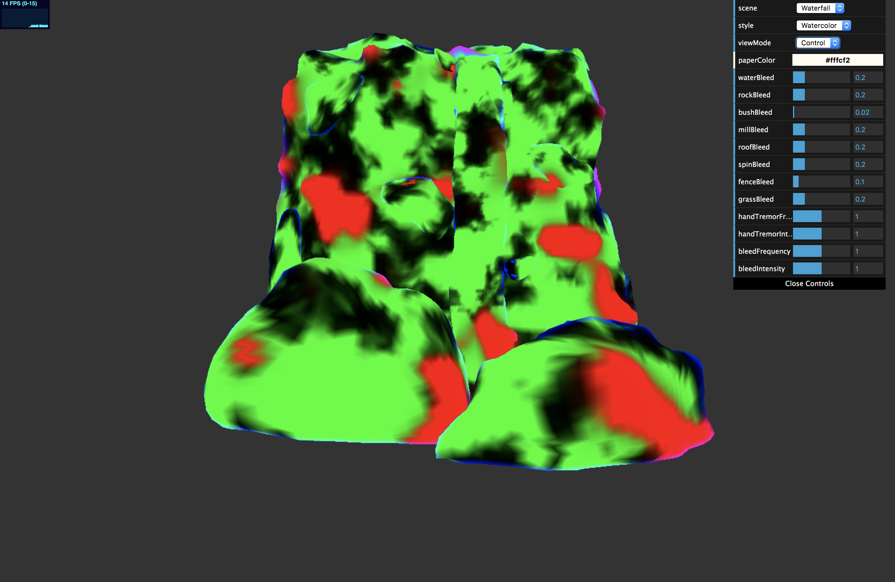
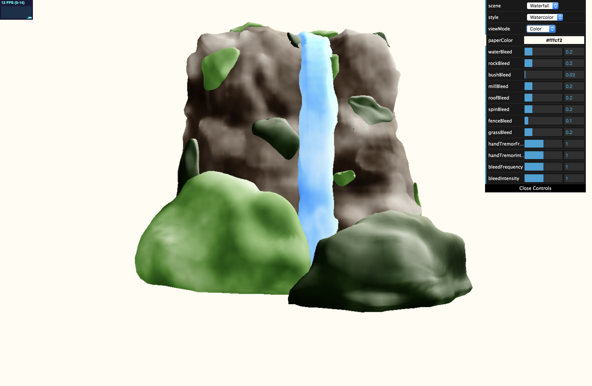
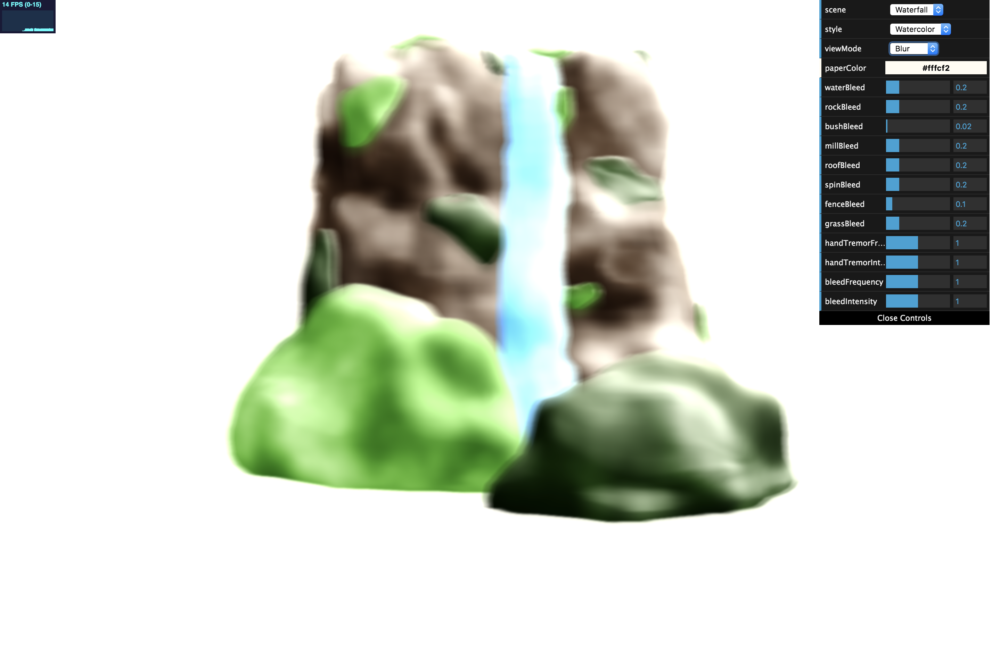
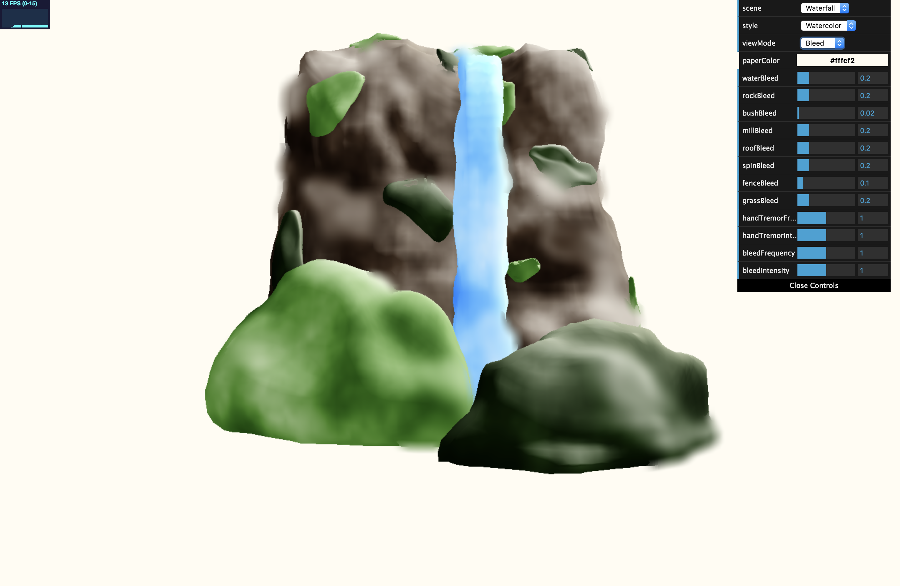
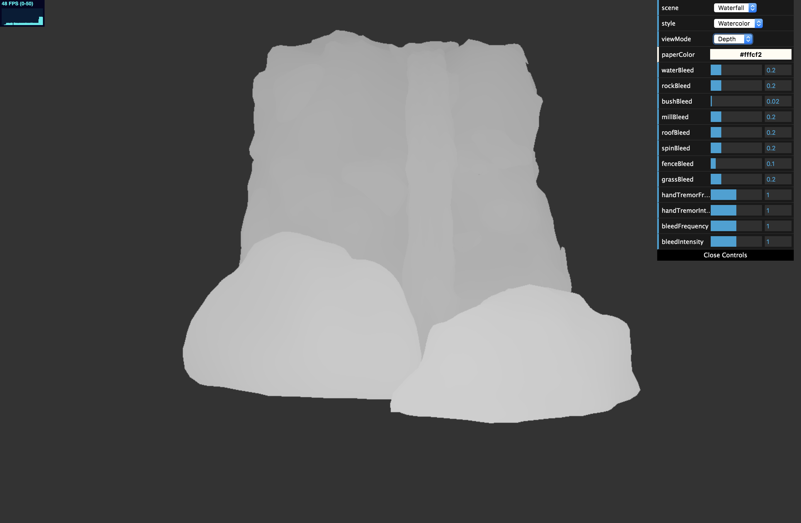
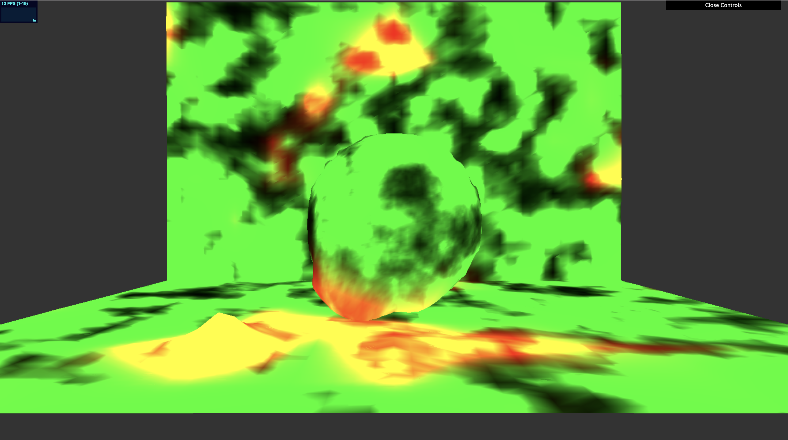
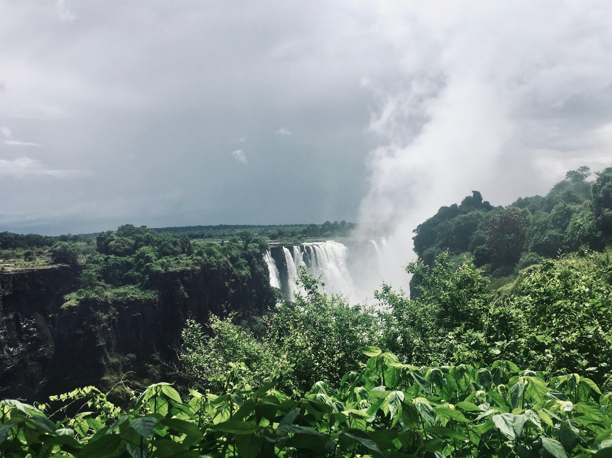

# Watercolor Stylization, Grace Gilbert (gracegi)

## Demo Link
https://gracelgilbert.github.io/watercolor-stylization/

## Source
[Art-directed watercolor stylization of 3D animations in real-time](Sources/Art-directed_watercolor_stylization_of_3D_animations_in_real-time.pdf), by Montesdeoca, Seah, Rall, and Benvenuti.

## Description
This project is a real-time watercolor stylization with user controls. It takes in any input geometry and renders it to look like a realistic watercolor painting. The user has control over the paper color, how much blurring and bleeding there is overall, including the bleeding intensity per object, as well as the intensity and frequency of hand tremors. The user can choose between two scenes, a waterfall and a windmill scene, as well as two versions of the stylization, one that is pure watercolor, and one that applies an cubist effect. A volumetric raymarching feature is present in both scenes. In the waterfall scene, it serves as water spray from the base of the fall, and in the windmill scene, it serves as clouds floating above.

## External Resources:
- I adapted Joseph Klinger's [volumetric raymarching shader](https://www.shadertoy.com/view/4sjfzw)
- I looked at [this resource](Sources/thesis.pdf) for more information on volumetric raymarching
- I used Neil Mendoza's [rotation matrix glsl function](http://www.neilmendoza.com/glsl-rotation-about-an-arbitrary-axis/)
- I used [this source](http://dev.theomader.com/gaussian-kernel-calculator/) to calculate the gaussian kernals

## Implementation
### Shader pipeline
There are many linked shaders that are involved in creating the watercolor sylization.  Here I will describe the overall pipeline, followed below by a more detailed description of the steps:
- The paper color, which is user modifiable, is rendered to the screen to form the background for the geometry
- Vertex deformation is applied to the input geometry in a vertex shader.  At this stage, geometry is animated and control parameters are set
- Fragment shader applies a watercolor reflectance model and renders to a texture, "colorImage"
- A depth map is rendered to an image
- A control map is rendered to an image
- Guassian blur is applied to "colorImage"
- A depth aware guassian blur is applied to "colorImage" with the depth map and control map as texture inputs
- The two blurring passes, the control image, and "colorImage" are passed as input to a shader that combines them, applies the normal mapping of the paper, and outputs to a texture
- Volumetric raymarching is rendered ontop of the final texture and the result is output to the screen

The user can toggle which render pass is in view.

### Mesh deformation
There are two forms of mesh deformation.  The first is to achieve the effect of hand tremors and the second is for color bleeding.
#### Hand tremors
When painting with watercolors, edges are never perfectly straight. To mimic this effect, I deformed the edges of the mesh according to a sin curve. In the vertex shader, I evaluate a sinusoidal function at the vertex and push out the vertex along its normal by the sin function's value. I only want the deformation to occur at the edges of the geometry, so I scale how much the geometry is deformed by the dot product between the normal and the view vector. This ensures that the edges are deformed according to the sin function, but the rest of the geometry is smooth. The user is able to modify the frequency of the sin curve deformation, as well as the scale of it.   

  Without hand tremor vertex deformation (on test geometry in progress)

  With hand tremor deformation (on test geometry in progress) 

#### Color bleeding
In order to achieve the look of pigment that bleeds, which is an effect of watercolor, the geometry is deformed rather than just relying on blurring.  I use an FBM function to distribute a bleeding parameter over the geometry. In places that have a high bleeding amount I push out the geometry along its vertex normals scaled according to the bleeding parameter.  This bleeding parameter also gets stored in the control shader, as it is used later in the modified guassian blurring to intensify the blur of the bled portions of geometry. The user can control the density of the FBM bleeding distribution function, as well as the overall scale of this function.  Additionally, each object has its own bleeding parameter, so they user can intensify or reduce the bleeding of individual pieces of geometry.  

  Control map, where red determines color bleeding intensity 

  High frequency, high intensity bleeding

  No bleeding

### Reflectance model
The reflectance model outlined in the paper uses a similar method to lambertian shading, but modifies it to look more painterly. The dot product of the normal and light vector are altered by a dilution term to simulate color dilution. The color dilution occurs on the highlights of the surface, which is lightened and blended with the paper texture. The reflectance model ensures that the entire geometry is in color and brightens the highlight areas rather than darkening the shadowed areas. Noise is added to this dilution effect to give the effect of turbulence in the watercolors. The paper suggests using hand painted noise to make the turbulence more natural looking; however, I use layers of 3D FBM to create the turbulence effect.

  Full color texture with hand tremor and bleeding deformation and reflectance model but no blurring

  Reflectance model without turbulence effect (on test geometry in progress)

### Blurring passes
#### Gaussian blur
The first blurring pass is an 11 by 11 gaussian blur with a sigma value of 3.  This blur pass is used later in the edge darkening process.

  Gaussian blur pass 

#### Bleeding blur pass
This blurring pass is a much stronger blur, using a 21 by 21 guassian blur with a sigma value of 20. This blur is only applied to the areas of geometry with a high bleeding parameter, specifically the areas that had been extruded out in the vertex deformation stage. This gives the effect that those areas of geometry had high levels of pigment bleeding. When determining the blurred value of a pixel, I take the maximum blur value of all pixels within the kernel so that if a blurred section is at the edge of an object, the nearby non-blurred pixels still blur. This extends the blurring beyond the border of the object, as it would in real watercolor painting.

To achieve a realistic bleeding effect, I had to take into account the depth of the geometry, which is why a depth map is passed as input. If a non bled portion of an object is painted in front of a bled object, the bleeding of the background object should not spread into the foreground object, unless they are part of the same object. This is to reflect that people generally paint a complete object, rather than painting part of an object, letting it try, and then painting the rest.  Therefore, all of the pigment would be wet and therefore be able to bleed together, regardless of depth sorting. To accomplish this, each object has a unique ID, the previously mentioned check to avoid incorrect foreground and background interaction only occurs when the two objects have distinct IDS.

  Bleeding blur pass

  Depth Map

### Edge darkening
The final stage involves adding the edge darkening effect on top of the bleeded image. To do this, I start by subtracting the "ColorImage" color from the 11 by 11 gaussian blur image. I use the maximum RGB channel of this subtracted color value to calculate a darkening parameter. The final output color is the bleeded image color with each channel raised to this darkening parameter. Taking the difference between the blurred and non blurred images isolates the edges. The closer to the edge the larger the maximum RGB value will be.  When the bleeded color is raised to this power, it will raise the edges to a higher power. Since the colors are in the 0 to 1 range, raising to the higher power darkens them more. To further heighten the edge darking, I use a process similar to how I distribute hand tremor deformation, which is dotting the normal and view vector to identify the edges of geometry from the camera's perspective. I add darkening to these areas of the geometry to create a more intense edge darkening effect. Because edge darkening occurs in a screen space operation that only has access to the rendered out texture, to access the normal and view vector values, I perform the necessary calculations instead in the original vertex shader and store the edge darkening value in the blue channel of my control map.

The strength of this edge darkening effect is varied in scale according to a parameter that is stored in the control map and created with FBM, preventing entire edges from being darkened.  This makes the effect it more natural looking.

  Control texture, where Green determines edge darkening and blue represents grazing angle

### Paper texture and normal map
To create the feel of rough watercolor paper, I use noise to create a heightfield, and then use that heightfield as a bump map to distort the normals of the flat image. The paper noise is worley noise layered with FBM. I sample this height map at a point an epsilon away in each direction and use these to find the gradient normal, which I apply with lambertian shading.

  Modified paper color 

### Volumetric Raymarching
As a final pass layered on top of the watercolored geometry, I perform a volumetric raymarching to create either water spray in the waterfall scene or clouds in the windmill scene. I adapted a volumetric raymarcher from Joseph Klinger's Shadertoy shader. As a ray is marched throughout the scene, it accumulates density based on a 3D density distribution, and the larger the density, the stronger the volume's color appears. 

In the waterfall scene, the density distribution is a high frequency 3D FBM distribution. This noise is animated to move vertically over time, as well as in the x and z direction according to layered sin curves to add more natural variation. The density drops off gradually according to the distance from the base of the waterfall. This this dropoff distance is distorted 3D FBM animated in all three directions so the spray does not appear static and smooth. 

In the windmill scene, the density distrubition is made of a low frequency 3D FBM function.  If the density is below 0.3, it is set to 0, creating sharper stepped edges to the clouds, which adds stylization to them to fit the watercolor look. The density is also scaled by the screenspace y value so the clouds only appear at the top of the screen in the sky. They are animated in the x and z direction to appear as if they are moving towards the camera at a slight right facing angle. The light color for the clouds is warm toned, adding color to the scene rather than having pure white clouds. 

### Scene construction and inspiration
I modeled all geometry in Maya and imported each piece as a separate OBJ file to allow for object specific colors, IDs, and various blurring and bleeding parameters.

The waterfall scene is inspired by the Victoria Falls of Zimbabwe, though on a smaller scale.

  Victoria Falls reference image 

### Cubism feature
A combination of accidents and mistakes led to an interesting variation of the watercolor shader that created a cubism effect. I decided to keep this as a toggle option. The vertex deformation of this effect is acheived by making the hand tremor deformation extreme, creating sharp, square extrusions. The shading for this effect is created by using incorrect parameters in calls to smoothstep in the 3D interpolation function used in the noise calculation for turbulence distribution.

  Cubism effect on waterfall scene

  Cubism effect on windmill scene

## Things to improve
- Right now, in order to apply the hand deformations, the input geometry must be highly subdivided in order to allow for smooth, high frequency deformations to it. However, this involves denser geometry than really necessary for the level of detail in the final image. A strategy that may improve this is to use a geometry shader that tesselates the geometry only in the areas that require the high level detail for vertex deformation. This would allow for low poly geometry to still have smooth deformation, as higher detail would be created in areas that need to be deformed. 
- Currently, the positioning of the volumetric effects depend on the camera position and gets distorted or out of place with certain camera movements. A potential way to improve this would be to project the worldspace positioning of the density function to camera space so it is consistent with the camera movements.
