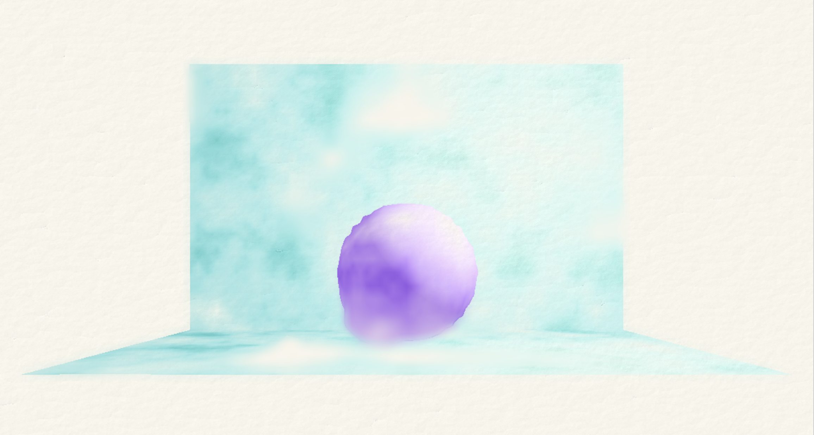

# watercolor-stylization

## Demo Link:
https://gracelgilbert.github.io/watercolor-stylization/

## Source:
[Art-directed watercolor stylization of 3D animations in real-time](Sources/Art-directed watercolor stylization of 3D animations in real-time.pdf)

## Progress:
### Shader pipeline setup
There are many linked shaders that are involved in creating the watercolor sylization. I start by creating a paper texture, which is 2D layered noise to create a normal map rendered with lambertian shading. I then render geometry on top of that texture.  There are then multiple shaders. I will first describe the overall pipeline and then describe the steps in more detail below.  First the geometry goes through the "color" shader, which deforms the geometry and applies a reflectance model and renders to a texture called "colorImage".  This color shaders takes in the paper texture so the paper texture can show through the watercolors. Two more passes use the same vertex deformation but different fragment shaders, rendering out a depth map texture and a control map texture, which store parameters in the RGBA channels for later use.  Next, the texture "colorImage" is passed through a guassian blur and saved as a blurred texture, and is passed through a modified guassian blur saved as a bleeded texture. The modified gaussian blur uses the control map and the depth map. Finally, the original color texture and the two blurred textures are combined in a final pass output to the screen.

Something I may want to change about my rendering pipeline is to have one fragment shader write to three textures, the "colorImage" texture, the depth map, and the control map, rather than having three separate shaders and render the geometry three times.  

### Mesh deformation
There are two forms of mesh deformation.  The first is to achieve the effect of hand tremors and the second is for color bleeding.
#### Hand tremors
When painting with watercolors, edges are never perfectly straight. To mimic this effect, I deformed the edges of the mesh according to a sin curve. In the vertex shader, I evaluate a sinusoidal function at the vertex and push out the vertex along its normal by the sin function's value. I only want the deformation to occur at the edges of the geometry, so I scale how much the geometry is deformed by the dot product between the normal and the view vector. This ensures that the edges are deformed according to the sin function, but the rest of the geometry is smooth.  

  Without hand tremor vertex deformation

  With hand tremore deformation

#### Color bleeding
In order to mimic pigment that bleeds, which is an effect of watercolors, the geometry is actually deformed rather than just relying on blurring.  I use an FBM function to distribute a bleeding parameter over the geometry. In places that have a high bleeding amount I push out the geometry along its vertex normals according to the bleeding parameter.  This bleeding parameter also gets store in the control shader, as it is used later in the modified guassian blurring to intensify the blur of the bled portions of geometry. 

  Control texture, where Red determines color bleeding intensity 

### Reflectance model
The reflectance model outlined in the paper uses a similar method to lambertian shading, but modifies it to look more painterly. The dot product of the normal and light vector are altered by a dilution term to simulate color dilution.  This term determines where dilution occurs most heavily, and these portions of the geometry are lightened and blended with the paper texture. The reflectance model ensures that the entire geometry is in color and brightens the highlight areas rather than darkening the shadowed areas. Noise is added to this brightening effect to give the effect of turbulence in the watercolors. The paper suggests using hand painted noise to make the turbulence more natural looking, but at least for now, I just use 3D FBM to create the turbulence effect.

  Full color texture with hand tremor and bleeding deformation and reflectance model

  Reflectance model without turbulence effect 

### Blurring passes
#### Gaussian blur
The first blurring pass is a 5 by 5 gaussian blur with a sigma value of 1.  This blur pass is used later in the edge darkening process.

  Gaussian blur pass 

#### Bleeding blur pass
This blurring pass is a much stronger blur, using a 21 by 21 guassian blur with a sigma value of 20. This blur is only applied to the areas of geometry with a high bleeding parameter, specifically the areas that had been extruded out in the vertex deformation stage. This gives the effect that those areas of geometry had high levels of pigment bleeding. To only bleed in certain areas, I have an average bleed amount variable. When I iterate through the pixels that are taken into account in the gaussian blur, I sample the control map at those pixels and average out their bleeding values.  I then scale the blurred color by this average bleeding amount and scale the non blurred color by 1 - the average bleeding amount and add the two colors together. 

  Bleeding blur pass

### Compositing effects
The final stage involves adding the edge darkening effect on top of the bleeded image. To do this, I start by subtracting the "ColorImage" color from the 5 by 5 gaussian blur image. I then take 1 + the maximum of the RGB channels of this subtracted image color. The final output color is the bleeded image color with each channel raised to this 1 + max(RGB) value. Taking the difference between the blurred and non blurred images isolates the edges. The closer to the edge the larger the maximum RGB value will be.  When the bleeded color is raised to this power, it will raise the edges to a higher power. Since the colors are in the 0 to 1 range, raising to the higher power darkens them more.  Therefore, this process darkens the edges, which is a realistic effect when painting with watercolors.  The strength of this edge darkening effect is scaled by a parameter that is stored in the control map and created with FBM, preventing entire edges from being darkened.  This makes it more natural looking.

## Next Steps:
### Refine bleeding 
Right now, the bleeding algorithm does not take into account the depth of the objects.  However, the algorithm presented in the paper does use the depth map to determine which areas get blurred.  In particular, it will detect if an object is in the foregrond and blur into the background but not let the background blur into the foreground object. I plan to implement this depth aware bleeding algorithm. 

### Refine edge darkening
Currently, the edge darkening effect has not been working exactly as intended.  When in full effect on all edges, it creates a thin darker line near the edge but not right on the edge. To fix this, I will first try increasing the blur that I am using for edge detection so it finds a larger area as the edge to darken rather than a thin line.
### Refine paper interaction
Currently, the paper texture only shows through the color when it is diluted enough for the paper texture to come through.  However, in real water colors, the bump of the paper texture applies to the ares with pigment as well.  I plan to apply the normal mapping of the paper to the entire image.  The color of the paper will stay in just the diluted areas, but the bump will be applied throughout.
### Setup environment
Once I have the shader working, I would like to set up a scene of a waterfall, the Victoria Falls of Zimbabwe.  I plan to model simplified geometry in Maya and import that into my project. While the geometry will be fairly simple and made of relatively solid colors, this fits within the style of water color paintings. I would like to do a simple animation of the waterfalls, and perhaps some of the bushes in the foreground and background. For the waterfalls, it would not be a realistic simulation, but a noise function where the sampling is animating vertically overtime to give a falling effect. 

  Victoria Falls reference image 

### Add volumetric effect
If time permits, I would like to add a volumetric rendering effect to create water mist coming from the waterfall and try to integrate this with the watercolor stylization. To do this, I would look at this paper for reference, along with [this](https://www.shadertoy.com/view/4sjfzw) shadertoy example, https://www.shadertoy.com/view/4sjfzw
